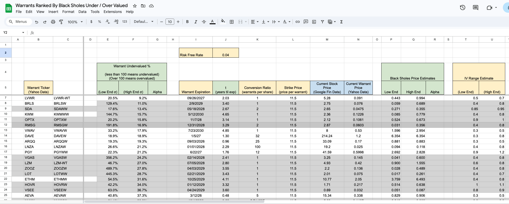
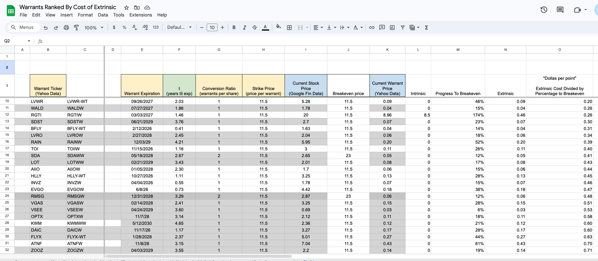
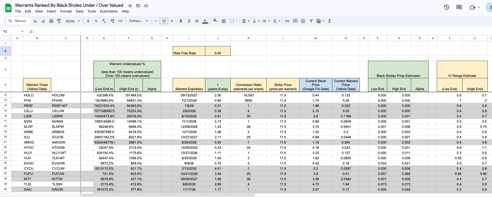
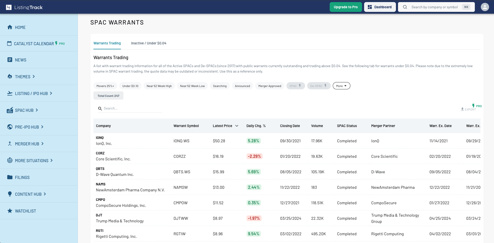
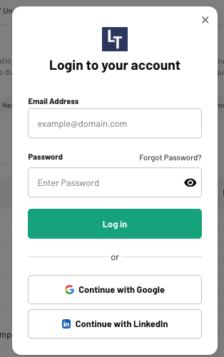
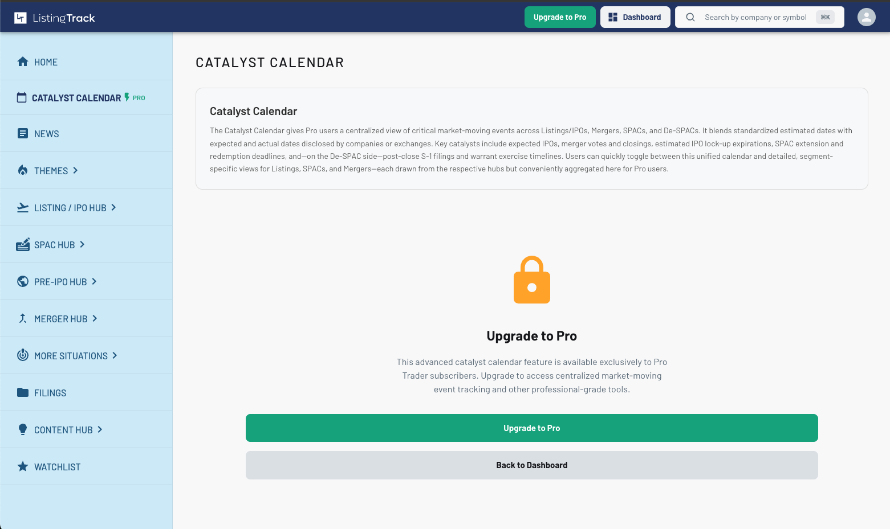

# Warrants Ranking App Whitepaper
Ideas for a freemium model webapp that helps traders compare stock warrants.

 

## Buy Undervalued & Sell Overvalued

If you knew which warrants were especially undervalued you could buy those.

Also, depending on borring fees, etc- you could short warrants that are especially overvalued.

Consider warrants that are very overpriced and / or have very high borrow fees- are they "overpriced" because people are _overly_ willing to pay a lot for the extrinsic value because they anticipate the price going up? If you think this is the case buying the underlying stock could be a good play. 

Consider warrants that are very overpriced and / or have very high borrow fees- are they "overpriced" because people are _overly_ willing to short the underlying because they think it will go down? If you think this is the case shorting the underlying stock could be a good play. 

Consider warrants that are very overpriced yet still dirt cheap pennies- is it "overpriced" because the fundamental company is unprofitable / mismanaged / plagued by fraud? If you think this is the case shorting the underlying could be a good play. 

 

## Black Scholes Based Rankings

The Black-Scholes Formula (or Black-Scholes-Merton for dividend paying securities) is a way of pricing options, warrants, and other "convertible securities" based on some given assumption of _volatility._

 

### Implied Volatility

In our brokerage accounts though things are calculated backwards- volatility is derived from the price we see in the markets.

This is why we often hear volatility in this context referred to as "implied volatility"- the current price is _implying_ some amount of volatility, and if you think the true volatility is higher or lower then you can respectively go long or short the convertible security.

 

### Not Much Public Data For Warrants

I could not find any APIs or brokerages that provide information about warrants specifically for things like iv, delta, gamma, etc.

So, I created a spreadsheet that uses these formulas and incorporates different conversions ratios and expiration dates.

For underlyings that have options, looking at the iv for call options with a similar strike and expiration can be a good ballpark estimate for what the warrant iv should be.

 

### Low end IV and High End IV
In the spreadsheet the yellow columns for "IV Range Estimate" are manually filled in for each security. We then use each to calculate a respective low and high "black sholes price estimate"- in other words, a low-end and high-end range for what we think the warrant _should_ be trading at if that iv number is accurate. 

 

### A "Right Now" View of Over / Under Valued
The black sholes formula assumes brownian motion and literally uses a standard normal distribution in its calculations.

It compares the warrant to the underlying stock, and so very "undervalued" warrants here mean that the warrant price is lower than what it should be for the current underlying price, time left to expiration, etc.

Since the expectation is that either the underlying will come down or the warrant will come up so that they are both more fairly valued relative to each other, that means also that warrants found to be undervalued or overvalued by black sholes could potentially be good hedge candiates.

For "undervalued" warrants, we could buy the warrants and short the underlying for a bit of a hedge, or for "overvalued" warrants we could short the warrants and go long the underlying (the preferred system of Ed Thorp as described in his 1967 book Beat The Market).

 

### Traps to Avoid While Reading Black Sholes Rankings

todo

 

Warrants, most undervalued compared to black sholes estimate, 9/16/25  

<!--  -->

  
most overvalued:

  

 

## "Cost of Extrinsic" Based Rankings

While the black sholes rankings give us a good "right now" pricing snapshot for our warrants, the cost-of-extrinsic pricing system is a future-looking model that considers:

1) how far each warrant is from breakeven
2) how much time is left in the warrant
3) how expensive the warrant is

 

### Dollas Per Point
The final metric we use for rankings is "dollas per point", in other words the cost of each warrant per percentage point of the progress we've made towards breakeven.

dollas_per_point = extrinsic_cost_of_warrant / percentage_progress_to_breakeven.

 

### Why Progress to Breakeven?

 

### Hedging Opportunities
Suppose we have some very "undervalued" warrants based of their price and progress towards breakeven.

If the underlying drops significantly then the warrants have made _less_ total progress towards breakeven, and the warrants should be less undervalued...

So for that reason we could also consider for underpriced warrants buying the warrants and shorting some of the underlying. On the flip side for "overvalued" warrants you might consider shorting the warrants

 

### The Mix Is Everything
In Ed Thorp's book he says multiple times that it's all about the "mix" in hedging- ie the ratio of how much underlying you are long or short vs how much of the corresponding warrant you are long or short.

Finding the right mix is key.

To be honest, these tables won't really tell you the exact mix to be completely "delta-neutral" but that could potentially be on our roadmap for the black sholes table.

### Why Breakeven Matters?
Warrants that are "in the money" will have an instrinsic component that is almost 1-to-1.

If we can scoop up cheap out-of the money warrants and ride them across the line into the money then we'll almost certainly be caking with intrisinc plus some extrinsic, dependening on how much time is left until expiration. We can also find warrants that are "cheap" relative to others in a similar progress percentage  

Looking at "percentage to breakeven" is also a good way to kind of normalize the numbers across all different asssets with different underlying prices, warrant prices, conversion ratios, etc.

### Cost of Extrinsic Spreadsheet Screenshots 

Example of my manually created spreadsheet.
 
 

Warrants, most undervalued by comparing to other warrants the price per percentage point of progress towards breakeven, 9/1/25  

  
most overvalued:

  

<!-- ## Reasoning And Calculations Behind Black Sholes Rankings
todo
 
  -->

## Inspiration

The inspiration for this project began with the great freemium app: [listicktrac.io](listicktrac.io) 

 

Here is an example of some data shown on the "SPAC warrants" page of the site:

 

There's also a login screen with password / sso with goole or linkedin login:

 
Here's an example of some content that you can only see by paying for the pro membership.
 

 